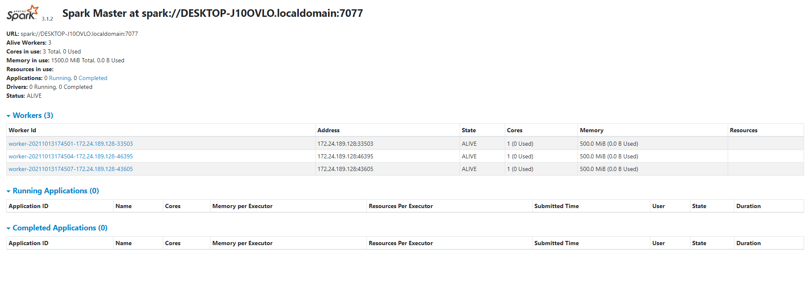
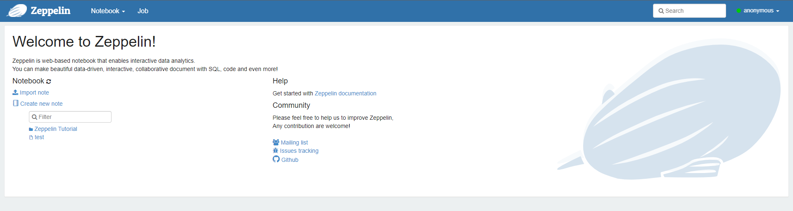

### Spark Standalone 구성 및 Zeppelin 설치

#### spark 설치 및 구성

```bash
wget https://dlcdn.apache.org/spark/spark-3.1.2/spark-3.1.2-bin-hadoop3.2.tgz

tar -xvf spark-3.1.2-bin-hadoop3.2.tgz
```


```bash
ln -s spark-3.1.2-bin-hadoop3.2/ spark
export PATH=$PATH:{SPARK_HOME}/bin
```

${SPARK_HOME}/conf/ 경로에 있는 spark-env.sh에 내용 추가

나는 worker 개수만 지정해 주었다. 나머지는 default

```bash
cp spark-env.sh.template spark-env.sh
vi spark-env.sh

# 아래 내용 추가
#export SPARK_MASTER_IP='172.24.189.128' (single node이므로 localhost)
#export SPARK_MASTER_HOST=spark-master (host name 설정, /etc/hosts 파일에도 적어야함.)
#export SPARK_MASTER_WEBUI_PORT=7777
export SPARK_WORKER_INSTANCES=3 (default 1)
#export SPARK_EXECUTOR_CORES=1 (default 1)
#export SPARK_EXECUTOR_MEMORY=1g (default 1G)

```

Web UI로 master node 확인가능



worker node 실행, 메모리 및 코어 설정

```bash
~/spark/sbin$ sh start-slave.sh spark://DESKTOP-J10OVLO.localdomain:7077 -m 500m -c 1
```

### Zeppelin 설치

```bash
wget https://dlcdn.apache.org/zeppelin/zeppelin-0.8.2/zeppelin-0.8.2-bin-all.tgz
tar -xvf zeppelin-0.8.2-bin-all.tgz
ln -s zeppelin-0.8.2-bin.all zeppelin
```

#### zeppelin 환경설정

```xml
# zeppelin/conf$ zeppelin-site.xml

<configuration>

<property>
  <name>zeppelin.server.addr</name>
  <value>172.24.189.128</value>
  <description>Server binding address</description>
</property>

<property>
  <name>zeppelin.server.port</name>
  <value>7777</value>
  <description>Server port.</description>
</property>
```

```bash
# zeppelin/conf$zeppelin-env.sh 

export JAVA_HOME=/usr/lib/jvm/java-8-openjdk-amd64
export MASTER=spark://DESKTOP-J10OVLO.localdomain:7077
export SPARK_HOME=/home/jungik/spark
```


#### zeppelin daemon start

```bash
~/zeppelin/bin$ ./zeppelin-daemon.sh start
```

jvm process status 확인

```
jps
1489 ZeppelinServer
1522 Jps
1076 Worker
953 Worker
1005 Worker
686 Master
```

Zeppelin web ui에 접속 http://172.24.189.128:7777/



