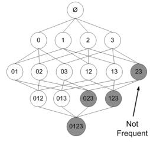
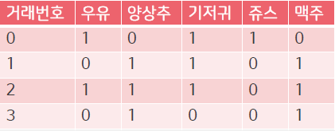
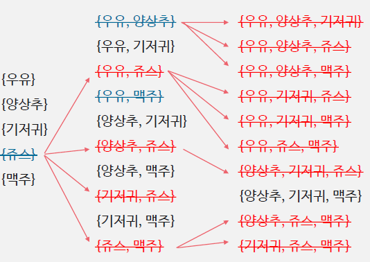
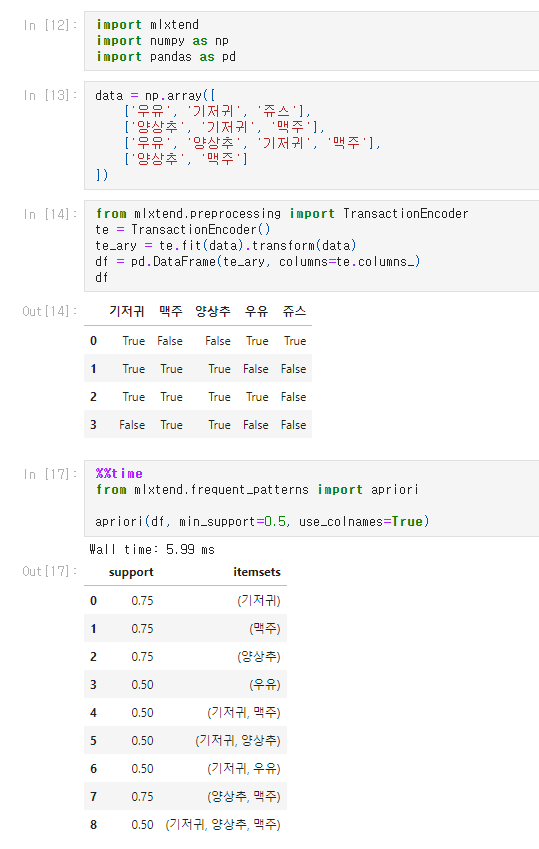
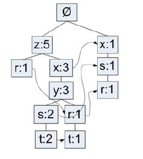
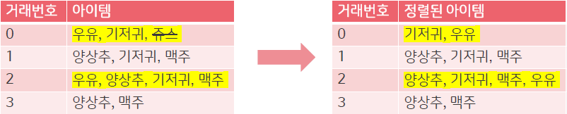
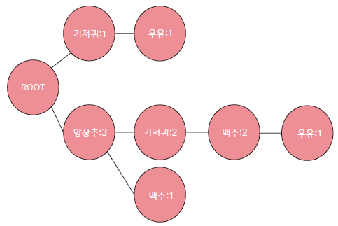
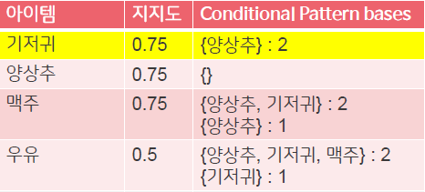
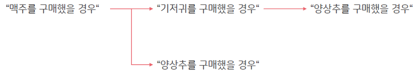
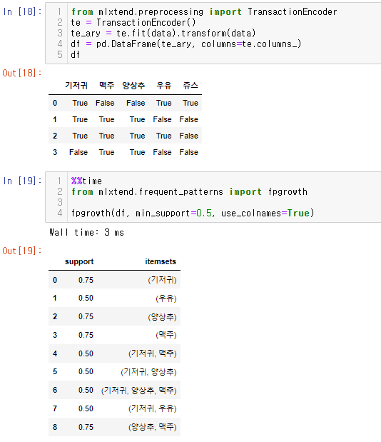

## 연관분석(Association Analysis)

룰 기반의 모델로서 상품과 상품사이에 어떤 연관이 있는지 찾아내는 알고리즘입니다. 이러한 연관은 2가지형태로 존재합니다.

### 규칙 평가 지표

**지지도(support)**

: 전체 데이터에서 관광지 X, Y에 대한 방문을 모두 포함하는 비율 (2개 이상 컬럼) 

 

 \- X -> Y 지지도 식 = X, Y 동시에 방문한 관광객 수 / 전체 관광객 수 

​             =  n(A, B) : 두 항목(X, Y)이 동시에 포함 수 / n : 전체 수

**신뢰도(confidence)** 

: 관광지 X를 방문하였을 때, Y를 같이 방문할 조건부 확률

 

 \- X -> Y 신뢰도 식 = X,Y 동시에 방문한 관광객 수 / X 방문 관광객 수

​             = X와 Y를 포함한 수 / X를 포함한 수

 \- 값이 클수록 X를 방문하였을 때, Y를 같이 방문하는 비율이 높음 ( X를 방문하였을 때, Y를 방문할 비율 )

 

**향상도(Life)**

: 관광지 X를 방문하였을 때, Y를 같이 방문하는 경우와 관광지 X의 방문여부에 상관없이 Y를 방문한 경우의 비율 ( 관광지 간의 독립성과 상관성을 나타내는 척도 )

 

 \- 하위 항목들이 독립에서 얼마나 벗어나는지의 정도를 측정한 값 

 \- 향상도 식 = X,Y 를 동시에 방문한 관광객 비율 / (X를 방문한 관광객 비율 * Y를 방문한 관광객 비율)

​         = 신뢰도 / Y가 포함될 거래율 

 \- 향상도가 1에 가까우면 : 두 상품이 독립
 \- 1보다 작으면 : 두 상품이 음의 상관성(감기약과 위장약) - 공통점을 가지지만 다른 기능 
 \- 1보다 크면 : 두 상품이 양의 상관성

 \- 분자와 분모가 동일한 경우 : Lift == 1, X와 Y가 독립(상관없음)
 \- 분자와 분모가 동일한 경우 : Lift != 1, X와 Y가 독립이 아닌 경우(상관있음)

 
\- 규칙 생성에서 support 값을 높게 설정할 수록 적은 수의 규칙만이 생성이 됩니다.(즉, 발생빈도가 높은 규칙들만 생성이 된다는 의미입니다.)

\- confidence 수치가 높으면 관광지 X를 방문하면 Y를 방문할 확률이 높아지는 것과 같습니다.

= confidence 확률식 

### 연관분석의 문제점

- 아이템의 증가에 따른 규칙의 수의 증가가 기하급수적으로 증가
- 아이템이 100개인 경우에는 규칙의 수가 **1.26 * 10^30**

## Apriori 알고리즘

Apriori 원리는 아이템셋의 증가를 줄이기 위한 방법입니다. 기본적인 아이디어는 **“빈번한 아이템셋은 하위 아이템셋 또한 빈번할 것이다＂**입니다. 즉, “빈번하지않은 아이템셋은 하위 아이템셋 또한 빈번하지않다＂를 이용해서 아이템셋의 증가를 줄이는 방법입니다.

💡**원리**

1. k개의 item을 가지고 단일항목집단생성(one-item frequent set)
2. 단일항목집단에서 최소지지도(support) 이상의 항목만 선택
3. 2에서 선택된 항목만을 대상으로 2개항목집단 생성
4. 2개 항목집단에서 최소지지도 혹은 신뢰도 이상의 항목만 선택
5. 위의 과정을 k개의 k-item frequent set을 생성할 때까지 반복

### 예시

1. **5개의 item을 가지고 단일항목집단 생성(one-item frequent set) : 우유, 양상추, 기저귀, 맥주, 쥬스**
2. 단일항목집단에서 **최소지지도(support) 이상의 항목**만 선택 (예: 최소지지도0.5)
   * P(우유) : 0.5
   * P(양상추) : 0.75
   * P(기저귀) : 0.75
   * ~~P(쥬스) : 0.25~~
   * P(맥주) : 0.75

3. **2에서 선택된 항목만을 대상으로 2개 항목집단생성** {우유, 양상추, 기저귀, 맥주}
   {우유, 양상추}, {우유, 기저귀}, {우유, 맥주}, {양상추, 기저귀}, {양상추, 맥주}, {기저귀, 맥주}
4. 2개 항목집단에서 **최소지지도 이상의 항목만 선택**
   * ~~{우유, 양상추} : 0.25~~ 
   * {우유, 기저귀} : 0.5 
   * ~~{우유, 맥주} : 0.25~~
   * {양상추, 기저귀} : 0.5
   * {양상추, 맥주} : 0.75 
   * {기저귀, 맥주} : 0.5
5. 위의 과정을 **k개의 k-item frequent set을 생성**할 때까지 **반복**
   - {우유}, {양상추}, {기저귀}, {맥주}
   - {우유, 기저귀}, {양상추, 기저귀}, {양상추, 맥주}, {기저귀, 맥주}
   - {양상추, 기저귀, 맥주}

위의 예시는 Support를 바탕으로 진행했지만, Confidence와 Lift를 이용해서도 진행 가능하고 함께 사용가능

**✔️장점**

- 원리가 간단하여 사용자가 쉽게 이해할수 있고 의미를 파악할 수 있음

- 유의한 연관성을 갖는 구매패턴을 찾아줌

**✔️단점**

- 데이터가 클 경우(item이많은경우)에 속도가 느리고 연산량이 많음
- 실제 사용시에 많은 연관상품들이 나타나는 단점이 있음

### 코드

## FP-Growth 알고리즘

FP Growth는 이전에 언급한 APriori의 속도측면의 단점을 개선한 알고리즘입니다. Apriori와 비슷한 성능을 내지만 FP Tree라는 구조를 사용해서 빠른 속도를 가진다는게 장점입니다. 하지만, 동일하게 발생하는 아이템셋(frequent itemsets)을 찾는데는 좋지만 아이템간의 연관성을 찾는 것은 어렵다는 단점이 있습니다.

**💡원리**

1. 모든 거래를 확인하여, 각 아이템마다의 지지도(support)를 계산하고 최소지지도 이상의 아이템만 선택
2. 모든 거래에서 빈도가 높은 아이템 순서대로 순서를 정렬
3. 부모노드를 중심으로 거래를 자식노드로 추가해주면서 tree를생성
4. 새로운 아이템이 나올경우에는 부모노드부터 시작하고, 그렇지 않으면 기존의 노드에서 확장
5. 위의 과정을 모든 거래에 대해 반복하여 FP TREE를 만들고 최소지지도이상의 패턴만을 추출

### 예시 

1. 모든 거래를 확인하여, 각 아이템마다의 지지도(support)를 계산하고 **최소지지도 이상의 아이템**만 선택
2. 모든 거래에서 **빈도가 높은 아이템 순서대로** **순서를 정렬**

> 쥬스가 삭제되고, 빈도가 높은 {양상추, 기저귀, 맥주} -> {우유} 순서대로 정렬

3. 부모노드를 중심으로 거래를 **자식노드로 추가해주면서 tree를생성**

4. **새로운 아이템이 나올 경우에는 부모노드부터 시작**하고, 그렇지 않으면 **기존의 노드에서 확장**

5. 지지도가 낮은 순서부터 시작하여, 조건부패턴을 생성
6.  모든 아이템에 대해서 반복 (우유 -> 맥주 -> 양상추 -> 기저귀)
   * 우유 - {양상추, 기저귀, 맥주} : 2, {기저귀} : 1
   * 맥주 - {양상추, 기저귀} : 2, {양상추} : 1
   * 양상추 - None
   * 기저귀 - {양상추} : 2

7. **Conditional Pattern bases**를 기반으로 패턴 생성

✔️**장점**

- Apriori 알고리즘보다 빠르고 2번의 탐색만 필요로 함

- 후보 Itemsets 을 생성할 필요없이 진행 가능

✔️**단점**

- 대용량의 데이터셋에서 메모리를 효율적으로 사용하지 않음
- Apriori 알고리즘에 비해서 설계하기 어려움
- 지지도의 계산이 FP-Tree가 만들어지고 나서야 가능함

### 코드 

