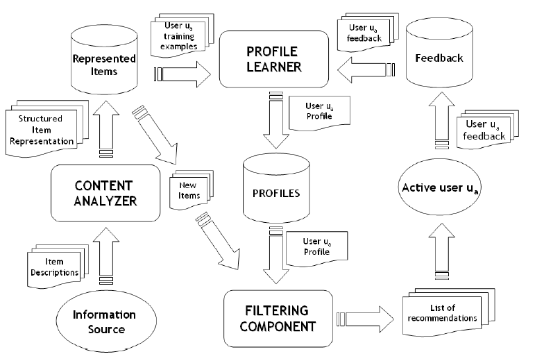
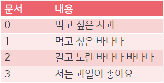
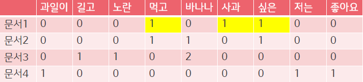
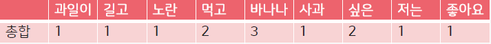
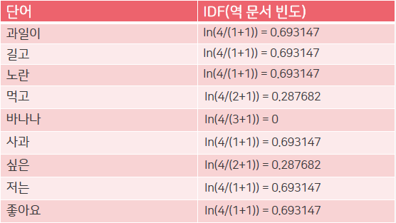
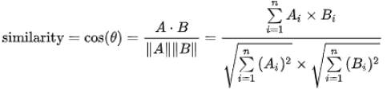
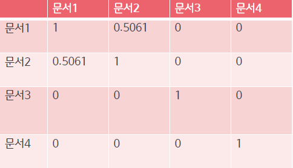
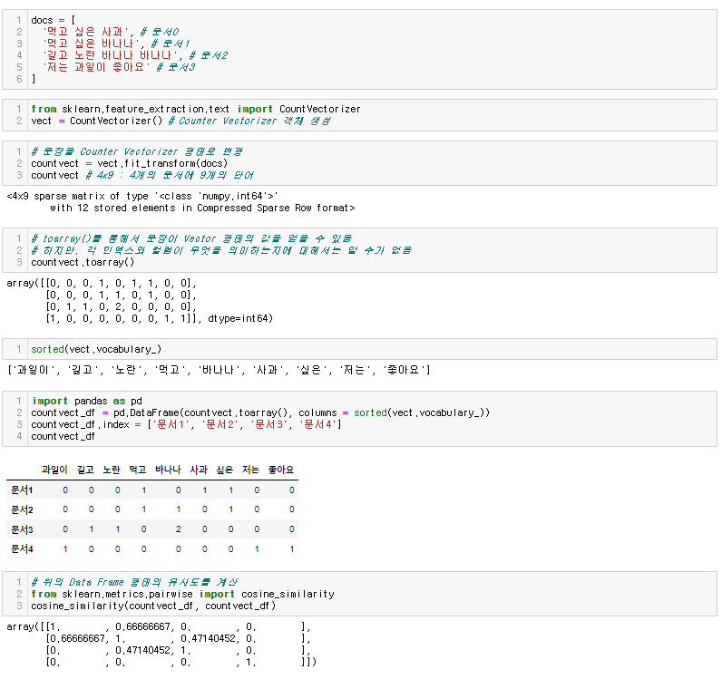
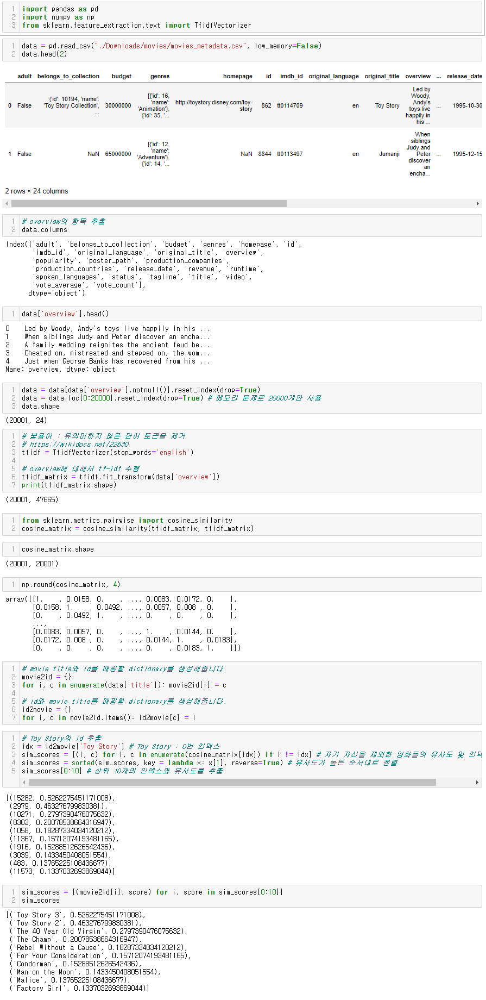

추천 알고리즘에도 종류가 몇 가지 존재한다. 크게 **'컨텐츠 기반 필터링'** 과 **'협업 필터링'**으로 나뉘어 진다. **'협업 필터링**'에서는 또 '최근접 이웃 기반' 으로 하는 것과 '잠재요인 기반'으로 세부적으로 분류됩니다.

이 중 **컨텐츠 기반 추천 시스템**은 사용자가 이전에 구매한 상품 중에서 좋아하는 상품들과 유사한 상품들을 추천하는 방법입니다.

# 컨텐츠 기반 필터링

여기서 '필터링'이란 쉽게 말해 **'추천'**이라고 할 수 있습니다. 컨텐츠 기반 필터링은 기본적으로 컨텐츠를 구성하는 내용 즉, **텍스트에 기반하여 문서 유사도를 측정해 비슷한 다른 컨텐츠를 추천하는 것**을 말합니다. 여기서 유사도란, 텍스트를 벡터화 시킨 후 벡터들간의 거리를 측정하는 것입니다. 벡터간의 거리를 측정하는 여러가지 방식이 있습니다.

## 💡유사도 함수

### 1. 자카드 유사도

자카드 유사도(자카드 지수)는 두 문장을 각각 단어의 집합으로 마든 뒤 두 집합을 통해 유사도를 측정하는 방식 중 하나입니다. 측정하는 방법은 두 집합의 교집합을 두 집합의 합집합으로 나눠줍니다.

자카드 유사도(자카드 지수)의 공식은 위와 같습니다.

예시를 들어보면

두 문장의 교집합 개수는 6개, 합집합 개수는 24개이므로 자카드 유사도는 6/24 = 0.25 정도 됩니다

### 2. 코사인 유사도

코사인 유사도는 두 개의 벡터값에서 코사인 각도를 구하는 방법입니다. -1 ~ 1 사이의 값을 가지고 1에 가까울수록 유사하다는 것을 의미합니다. 이 유사도는 많이 사용되는데요. 이 이유는 단순히 좌표 상의 거리를 구하는 것에 비해 코사인 유사도는 두 벡터간의 각도를 구하는 것이기에 방향성의 개념이 더해지기 때문입니다.

그래서 문장이 유사하다면 같은 방향, 유사하지 않으면 직교 등으로 표현됩니다.

### 3. 유클리디안 유사도

유클리디안 유사도는 가장 기본적인 거리를 측정하는 유사도 공식입니다.

유클리디안 유사도는 유클리디안 거리라고 불리우죠. 그리고 L2 거리(L2 distance)라고도 불립니다. n차원 공간에서 두 점 사이의 최단 거리를 구하는 접근 방법입니다.

근데 앞서서 봤던 유사도들은 값이 0~1사이라던가 -1 ~ 1 이라던가 값의 범위가 정해져있는데 유클리디안은 값의 범위가 정해져있지 않습니다. 왜냐하면 거리이기 때문에 그렇습니다. 그래서 머신러닝이나 딥러닝을 할 때는 L1 정규화를 사용합니다. L1 정규화(L1 normalize)는 각 벡터 안의 요소 값을 모두 더한 것이 크기가 1이 되도록 벡터들의 크기를 조절하는 방법입니다.

### 4. 맨하탄 유사도

멘하탄 유사도는 멘타한 거리(Manhattan Distance)를 이용해서 유사도를 측정하고 흔히 L1 거리(L1 Distance)라고도 불리웁니다.

맨하탄 거리는 사각형 격자로 이뤄진 지도에서 출발점에서 도착점까지를 가로지르지 않고 갈 수 있는 최단 거리를 구하는 공식입니다.

위와 같은 그림이 있으면 유클리디언 거리(L2 거리, L2 Distance)는 초록색 선을 의미합니다.

이거는 도로에서 아무런 장애물이 없다고 가정했을 때 나오는 거라서 현실성이 부족합니다.

맨하탄 거리는 여기서 노란색 선을 의미합니다.

간단하게는 출발점에서 도착점까지의 가로, 세로 길이를 더하여 맨하탄 거리를 계산할 수 있습니다.

일반화 시키면 이렇게 됩니다.

### 5. **피어슨 유사도(Pearson Similarity)**

피어슨 유사도는 두 벡터가 주어졌을 때의 상관관계를 계산하는 것과 동일합니다. 각 벡터의 표본평균으로 normalization을 하고, 코사인 유사도를 구하면 그게 곧 피어슨 유사도 식입니다. 수식은 다음과 같습니다.

 

rrs=∑ni=1(Xri−¯¯¯¯¯¯¯Xr)(Xsi−¯¯¯¯¯¯¯Xs)√∑ni=1(Xri−¯¯¯¯¯¯¯Xr)2√∑ni=1(Xsi−¯¯¯¯¯¯¯Xs)2rrs=∑i=1n(Xri−Xr¯)(Xsi−Xs¯)∑i=1n(Xri−Xr¯)2∑i=1n(Xsi−Xs¯)2

 

계산된 피어슨 유사도가 1이면 양의 상관관계, -1이면 음의 상관관계, 0이면 상관관계가 없음(독립)을 의미합니다. 양의 상관관계란 비교하는 데이터 중 하나가 증가하면 다른 하나도 증가함(두 데이터가 유사하다)을 의미하고, 음의 상관관계는 하나가 증가하면 다른 하나는 감소함을 의미합니다.

## 💡 TF-IDF

TF-IDF는 특정 문서 내에 **특정 단어가 얼마나 자주 등장하는 지**를 의미하는 단어빈도(TF)와 전체 문서에서 특정 단어가 얼마나 자주 등장하는 지를 의미하는 역문서빈도(DF)를 통해서 **“다른 문서에서는 등장하지 않지만 특정 문서에서만 자주 등장하는 단어＂**를 찾아서 문서 내 단어의 가중치를 계산하는 방법입니다.

용도로는 문서의 핵심어를 추출, 문서들 사이의 유사도를 계산, 검색결과의 중요도를 정하는 작업 등에 활용할 수 있습니다.

> TF-IDF를 사용하는 이유

1. Item이라는 컨텐츠를 벡터로 "Feature Extract" 과정을 수행해준다.
2. 빈도수를 기반으로 많이 나오는 중요한 단어들을 잡아준다. 이러한 방법을 **Counter Vectorizer** 라고한다.
3. 하지만, Counter Vectorizer는 단순 빈도만을 계산하기에 조사, 관사처럼 **의미는 없지만 문장에 많이 등장하는 단어들도 높게 쳐주는 한계**가 있다. 이러한 단어들에는 패널티를 줘서 적절하게 중요한 단어만을 잡아내는게 TF-IDF 기법이다.

> **log를 씌워주는 이유**?
>
> 씌워주지 않으면 희귀 단어들에 엄청난 가중치가 부여되기 때문에 이러한 격차를 줄이기 위해 log를 사용한다.

### **🔑알고리즘**

- 데이터

- 문서 내 단어의 TF값 계산

* 단어의 DF값 계산

* 문서 내 단어의 IDF값 계산

* 문서 내 TF-IDF 값의 결과

* 문서간의 유사도를 계산 (코사인 유사도 이용)

✔️**장점**

- 직관적인 해석이 가능함

✔️**단점**

- 대규모 말뭉치를 다룰 때 메모리상의 문제가 발생함
  - 높은 차원을 가짐
  - 매우 sparse한 형태의 데이터임

## 코드 구현

### 예제

* 예제 : [https://wikidocs.net/24603](https://wikidocs.net/24603)