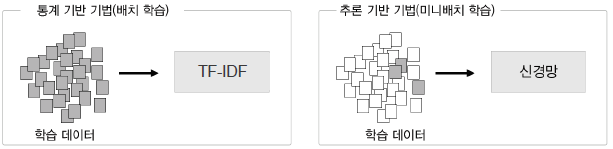
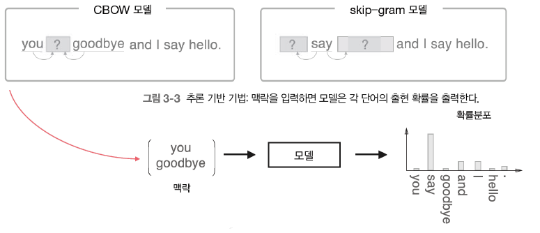
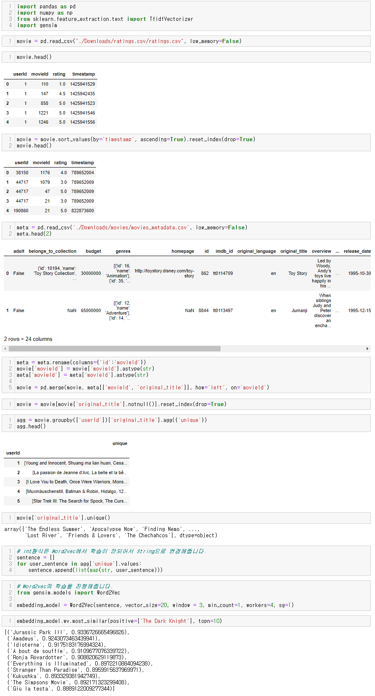

**통계 기반의 방법 단점**

- 대규모 말뭉치를 다룰 때 메모리 상의 문제가 발생
  - 높은 차원을 가짐, 매우 sparse한 형태의 데이터임
  - 예) 100만 개의 문서를 다루는 경우: 100만 개의 문서에 등장한 모든 단어를 추출해야 하고 이 때 단어의 수는 1문서당 새로운 단어가 10개면, 1000만개 정도의 말뭉치가 형성됨. 즉, 100만 x 1000만의 매트릭스가 형성
- 한번에 학습 데이터 전체를 진행함
  - 큰 작업을 처리하기 어려움
  - GPU와 같은 병렬처리를 기대하기 힘듬
- 학습을 통해서 개선하기가 어려움

---

# Word2Vec

추론: 주변단어(맥락)가 주어졌을 때 "?” 에 무슨 단어(중심단어)가 들어가는 지를 추측하는 작업

모델은 {you, say, goodbye, and, I, hello, .} 이라는 말뭉치 후보군 중에서 하나를 예측함.

잘못 예측할 경우 학습을 통해 점점 모델을 개선

📔**정의**

**Word2Vec**은 단어 간 유사도를 반영하여 단어를 벡터로 바꿔주는 임베딩 방법론입니다. 원-핫벡터 형태의 sparse matrix 이 가지는 단점을 해소하고자 저차원의 공간에 벡터로 매핑하는 것이 특징입니다. Word2Vec은 “비슷한 위치에 등장하는 단어들은 비슷한 의미를 가진다.“ 라는 가정을 통해서 학습을 진행합니다. 저차원에 학습된 단어의 의미를 분산하여 표현하기에 단어간 유사도를 계산할 수 있습니다.

추천 시스템에서는 단어를 구매상품으로 바꿔서 구매한 패턴에 Word2Vec을 적용해서 비슷한 상품을 찾을 수 있습니다.

Word2Vec에는 CBOW(Continuous Bag of Words)와 Skip-Gram 두 가지 방식이 있습니다. CBOW는 주변에 있는 단어들을 가지고, 중간에 있는 단어들을 예측하는 방법입니다. 반대로, Skip-Gram은 중간에 있는 단어로 주변 단어들을 예측하는 방법입니다.

## 💡 CBOW

**예문 : "The fat cat sat on the mat"**

 {"The", "fat", "cat", "on", "the", "mat"}으로부터 sat을 예측하려고 할 때, 예측해야하는 단어 **sat**을 **중심 단어(center word)**라고 하고, 예측에 사용되는 단어들을 **주변 단어(context word)**라고 합니다.

중심 단어를 예측하기 위해서 앞, 뒤로 몇 개의 단어를 볼지를 결정했다면 이 범위를 **윈도우(window)**라고 합니다. 예를 들어서 윈도우 크기가 2이고, 예측하고자 하는 중심 단어가 sat이라고 한다면 앞의 두 단어인 fat와 cat, 그리고 뒤의 두 단어인 on, the를 참고합니다.

윈도우 크기를 정했다면, 윈도우를 계속 움직여서 주변 단어와 중심 단어 선택을 바꿔가며 학습을 위한 데이터 셋을 만들 수 있는데, 이 방법을 **슬라이딩 윈도우(sliding window)**라고 합니다.

Word2Vec에서 입력은 모두 원-핫 벡터가 되어야 합니다.

CBOW의 인공 신경망을 간단히 도식화하면 위와 같습니다. 입력층(Input layer)의 입력으로서 앞, 뒤로 사용자가 정한 윈도우 크기 범위 안에 있는 주변 단어들의 원-핫 벡터가 들어가게 되고, 출력층(Output layer)에서 예측하고자 하는 중간 단어의 원-핫 벡터가 필요합니다. 뒤에서 설명하겠지만, Word2Vec의 학습을 위해서 이 중간 단어의 원-핫 벡터가 필요합니다.

CBOW의 인공 신경망을 좀 더 확대해서 보면 위와 같습니다.

CBOW에서 투사층의 크기 M은 임베딩하고 난 벡터의 차원이 됩니다. 다시 말해, 위의 그림에서 투사층의 크기는 M=5이기 때문에 CBOW를 수행하고나서 얻는 각 단어의 임베딩 벡터의 차원은 5가 될 것입니다.

두번째는 입력층과 투사층 사이의 가중치 W는 V × M 행렬이며, 투사층에서 출력층사이의 가중치 W'는 M × V 행렬이라는 점입니다. 여기서 V는 단어 집합의 크기를 의미합니다. 즉, 위의 그림처럼 원-핫 벡터의 차원이 7이고, M은 5라면 가중치 W는 7 × 5 행렬이고, W'는 5 × 7 행렬이 될 것입니다. 주의할 점은 이 두 행렬은 동일한 행렬을 전치(transpose)한 것이 아니라, 서로 다른 행렬이라는 점입니다. 인공 신경망의 훈련 전에 이 가중치 행렬 W와 W'는 대게 굉장히 작은 랜덤 값을 가지게 됩니다. CBOW는 주변 단어로 중심 단어를 더 정확히 맞추기 위해 계속해서 이 W와 W'를 학습해가는 구조입니다.

입력으로 들어오는 주변 단어의 원-핫 벡터와 가중치 W 행렬의 곱이 어떻게 이루어지는지 보겠습니다. 위 그림에서는 각 주변 단어의 원-핫 벡터를 x로 표기하였습니다. 입력 벡터는 원-핫 벡터입니다. i번째 인덱스에 1이라는 값을 가지고 그 외의 0의 값을 가지는 입력 벡터와 가중치 W 행렬의 곱은 사실 W행렬의 i번째 행을 그대로 읽어오는 것과(lookup) 동일합니다. 그래서 이 작업을 룩업 테이블(lookup table)이라고 부릅니다. 앞서 CBOW의 목적은 W와 W'를 잘 훈련시키는 것이라고 언급한 적이 있는데, 사실 그 이유가 여기서 lookup해온 W의 각 행벡터가 사실 Word2Vec을 수행한 후의 각 단어의 M차원의 크기를 갖는 임베딩 벡터들이기 때문입니다.

이렇게 각 주변 단어의 원-핫 벡터에 대해서 가중치 W가 곱해서 생겨진 결과 벡터들은 투사층에서 만나 이 벡터들의 평균인 벡터를 구하게 됩니다. 만약 윈도우 크기 n=2라면, 입력 벡터의 총 개수는 2n이므로 중간 단어를 예측하기 위해서는 총 4개가 입력 벡터로 사용됩니다. 그렇기 때문에 평균을 구할 때는 4개의 결과 벡터에 대해서 평균을 구하게 됩니다. 투사층에서 벡터의 평균을 구하는 부분은 CBOW가 Skip-Gram과 다른 차이점이기도 합니다. 뒤에서 보게되겠지만, Skip-Gram은 입력이 중심 단어 하나이기때문에 투사층에서 벡터의 평균을 구하지 않습니다.

이렇게 구해진 평균 벡터는 두번째 가중치 행렬 W'와 곱해집니다. 곱셈의 결과로는 원-핫 벡터들과 차원이 V로 동일한 벡터가 나옵니다. 만약 입력 벡터의 차원이 7이었다면 여기서 나오는 벡터도 마찬가지입니다.

이 벡터에 CBOW는 소프트맥스(softmax) 함수를 취하는데, 소프트맥스 함수로 인한 출력값은 0과 1사이의 실수로, 각 원소의 총 합은 1이 되는 상태로 바뀝니다. 이렇게 나온 벡터를 스코어 벡터(score vector)라고 합니다. 스코어 벡터의 각 차원 안에서의 값이 의미하는 것은 아래와 같습니다.

스코어 벡터의 j번째 인덱스가 가진 0과 1사이의 값은 j번째 단어가 중심 단어일 확률을 나타냅니다. 그리고 이 스코어 벡터는 우리가 실제로 값을 알고있는 벡터인 중심 단어 원-핫 벡터의 값에 가까워져야 합니다. 스코어 벡터를 𝑦^라고 하겠습니다. 중심 단어를 y로 했을 때, 이 두 벡터값의 오차를 줄이기위해 CBOW는 손실 함수(loss function)로 cross-entropy 함수를 사용합니다.

cross-entropy 함수에 실제 중심 단어인 원-핫 벡터와 스코어 벡터를 입력값으로 넣고, 이를 식으로 표현하면 위와 같습니다.

그런데 y가 원-핫 벡터라는 점을 고려하면, 이 식은 위와 같이 간소화시킬 수 있습니다. 이 식이 왜 loss function으로 적합한지 알아보겠습니다. c를 중심 단어에서 1을 가진 차원의 값의 인덱스라고 한다면, 는 y^가 y를 정확하게 예측한 경우가 됩니다. 이를 식에 대입해보면 -1 log(1) = 0이 되기 때문에, 결과적으로 y^가 y를 정확하게 예측한 경우의 cross-entropy의 값은 0이 됩니다. 즉,  이 값을 최소화하는 방향으로 학습해야 합니다.

이제 역전파(Back Propagation)를 수행하면 W와 W'가 학습이 되는데, 학습이 다 되었다면 M차원의 크기를 갖는 W의 행이나 W'의 열로부터 어떤 것을 임베딩 벡터로 사용할지를 결정하면 됩니다. 때로는 W와 W'의 평균치를 가지고 임베딩 벡터를 선택하기도 합니다.

## 💡 **Skip-gram**

Skip-gram은 CBOW를 이해했다면 메커니즘 자체는 동일하므로 쉽게 이해할 수 있습니다. 앞서 CBOW에서는 주변 단어를 통해 중심 단어를 예측했다면, Skip-gram은 중심 단어에서 주변 단어를 예측합니다. 앞서 언급한 예문에 대해서 동일하게 윈도우 크기가 2일 때, 데이터셋은 다음과 같이 구성됩니다.

인공 신경망을 도식화해보면 아래와 같습니다.

중심 단어에 대해서 주변 단어를 예측하므로 투사층에서 벡터들의 평균을 구하는 과정은 없습니다. 여러 논문에서 성능 비교를 진행했을 때, 전반적으로 Skip-gram이 CBOW보다 성능이 좋다고 알려져 있습니다.

### ✔️ 장점

- 협업 필터링은 다른 사용자들의 평점이 필요한 반면에, 자신의 평점만을 가지고 추천시스템을 만들 수 있음
- item의 feature를 통해서 추천을 하기에 추천이 된 이유를 설명하기 용이함
- 사용자가 평점을 매기지 않은 새로운 item이 들어올 경우에도 추천이 가능함

### ✔️ 단점

- item의 feature을 추출해야 하고 이를 통해서 추천하기 때문에 제대로 feature을 추출하지 못하면 정확도가 낮음. 그렇기에 Domain Knowledge가 분석시에 필요할 수도 있음
- 기존의 item과 유사한item 위주로만 추천하기에 새로운 장르의 item을 추천하기 어려움
- 새로운 사용자에 대해서 충분한 평점이 쌓이기 전까지는 추천하기 힘듬

## 코드 구현

---

**예제**
[https://wikidocs.net/22660](https://wikidocs.net/22660)
